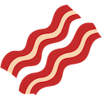
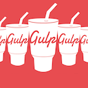
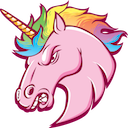

# slack-emoji
:suspect: My slack emoji collection and helper scripts

First, install dependencies:
```
yarn
```
or
```
npm i
```

To download emojis from your slack team run:
> don't forget to create config.json, see [config.example.json](config.example.json)

```
npm start
```
To generate preview for readme run:
```
npm run generate-md
```

---











